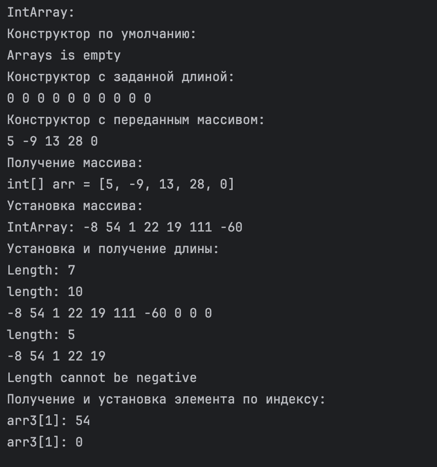
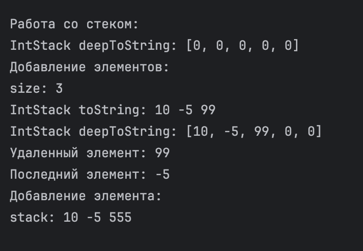

# Задание.
## Выполнить действия по разработке классов с использованием наследования. Протестировать каждый из написанных классов в отдельной процедуре в файле Main.java. Оформить отчет по работе.
> Обязательные – первые 2 пункта. По желанию все 4 пункта.
### 1. Создать класс IntArray – целочисленный массив фиксированного размера.
Поля:
- массивы целых чисел – данные массива
Методы:
- конструкторы
- необходимые геттеры/сеттеры (в т.ч. вычисляемые)
- получение/установка элемента по индексу
- toString

---

### 2. Создать класс IntStack – наследник IntArray – целочисленный стек, использующий для хранения элементов массив.
Поля:
- размер стека
Методы:
- конструкторы
- необходимые геттеры/сеттеры (в т.ч. вычисляемые)
- добавление элемента в верхушку стека
- удаление элемента из верхушки стека
- получение элемента с верхушки стека без удаления
- toString
- deepToString
> Примечание: можно использовать код с занятия.

